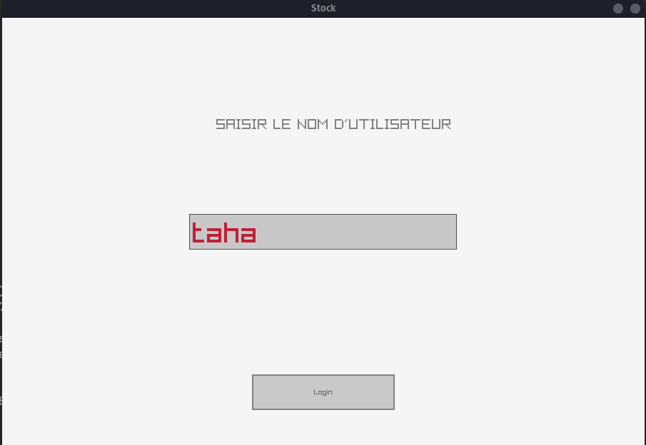
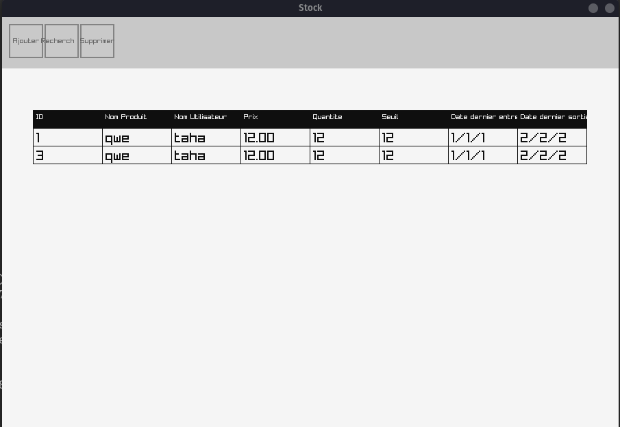
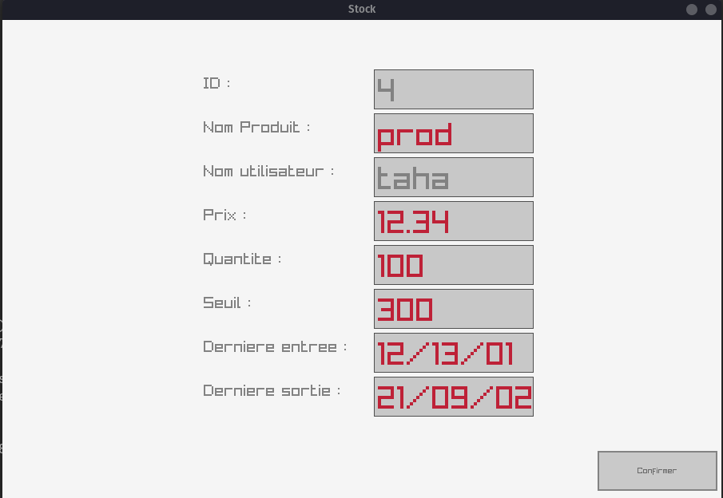
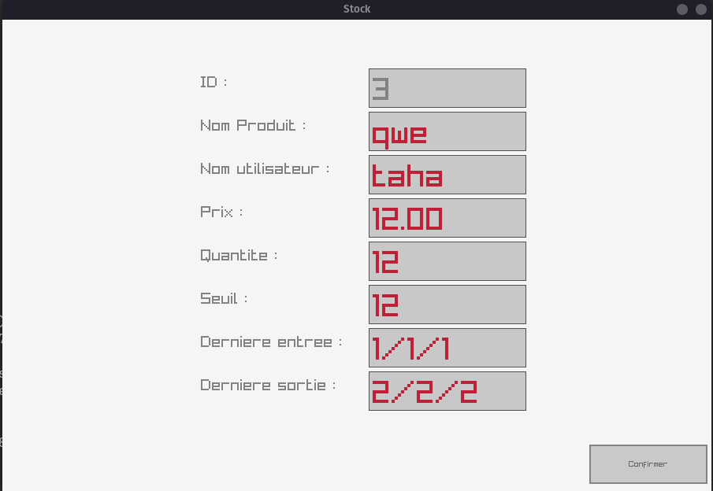
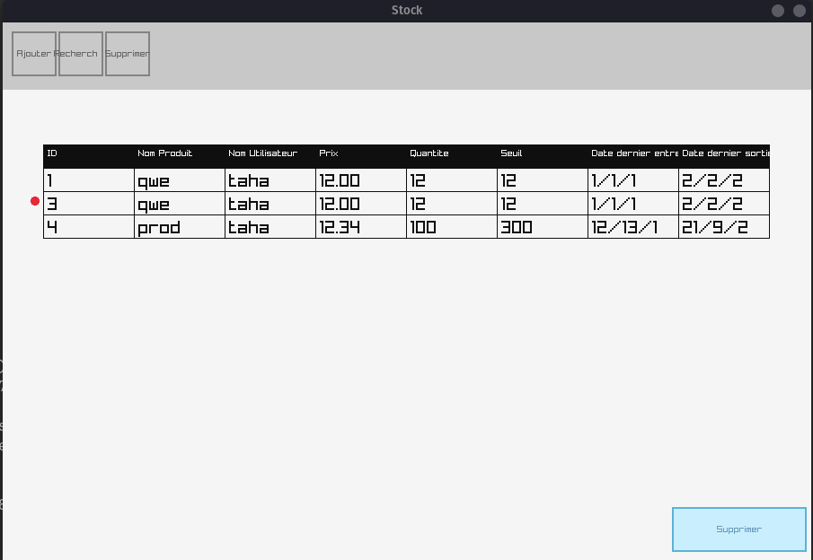
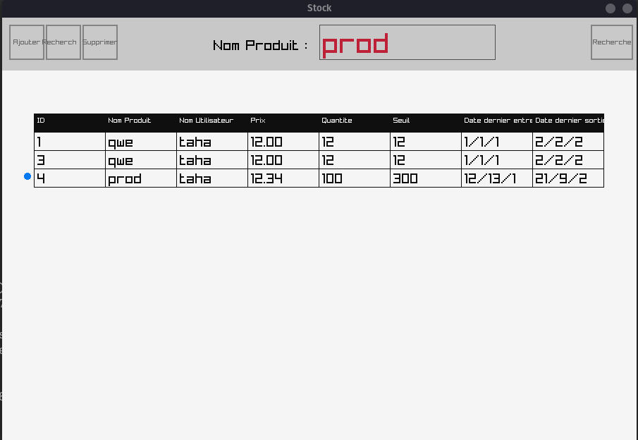

# Gestion de stock des produits

Ce projet consiste en une application de gestion de stock des produits, développée en utilisant le langage C et la bibliothèque Raylib et Raygui.

## Fonctionnalités de l'application

L'application comprend les fonctionnalités suivantes :
### Écran de connexion

Permet à l'utilisateur de se connecter à l'application en insérant son nom d'utilisateur.

### Tableau  des produits

Affiche une liste des produits avec leurs détails.
+ Son ID
+ Nom de produit
+ Nom d'utilisateur
+ Prix unitaire
+ Quantite en stock
+ Seuil d'alerte de stock
+ Date de dernière entrée en stock
+ Date de dernière sortie de stock


avec la possibilité de **trier les données** selon le prix ou le nom du produit.

### Ajout de produit

Permet à l'utilisateur d'ajouter un nouveau produit à la liste.

### Modification de produit

Permet à l'utilisateur de modifier les informations d'un produit existant.

### Suppression de produit

Permet à l'utilisateur de supprimer un produit de la liste.

### Recherche

Permet à l'utilisateur de rechercher des produits spécifiques.

## Comment exécuter l'application

Pour exécuter l'application, vous pouvez utiliser le fichier Makefile fourni pour simplifier le processus de compilation.

    Clonez ce dépôt sur votre machine locale.
    Ouvrez le terminal et accédez au répertoire du projet.
    Utilisez la commande make pour compiler le code source.
```
    make
```

    Une fois la compilation terminée, exécutez l'application générée.


```
    ./stock
```

Le Makefile fourni automatisera le processus de compilation en utilisant les options appropriées pour compiler le code source avec la bibliothèque Raylib.
### Configuration requise

+ Compilateur C
+ Bibliothèque Raylib

## Auteurs

Ce projet a été développé par **Taha Ait Baissi** de **G3**.